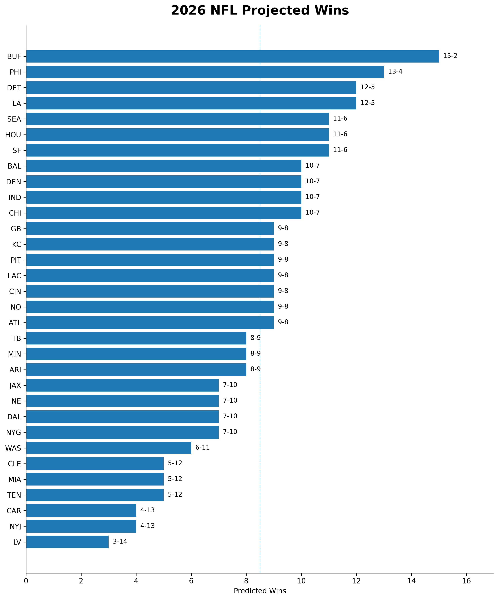
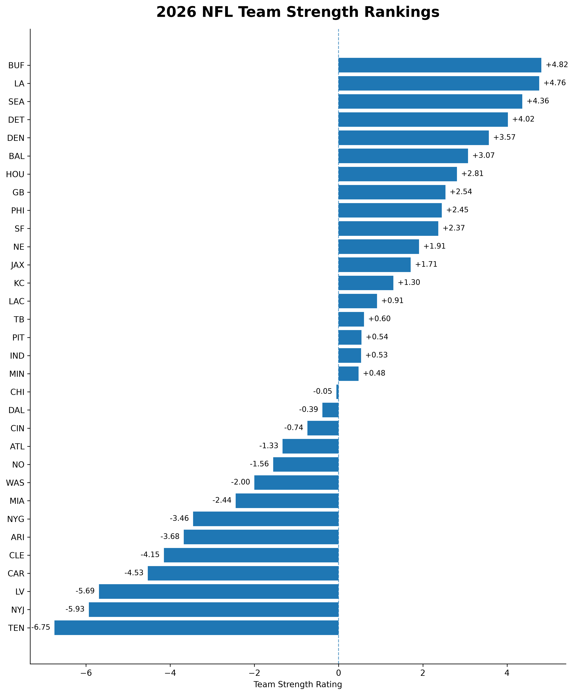
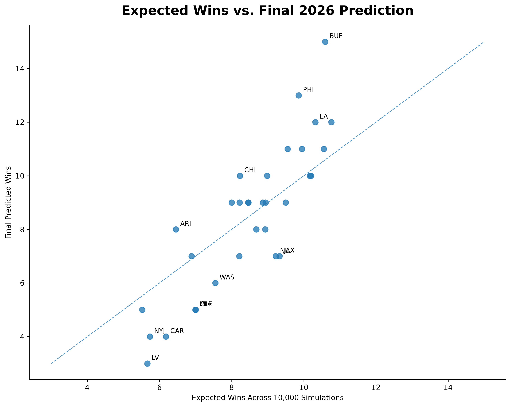
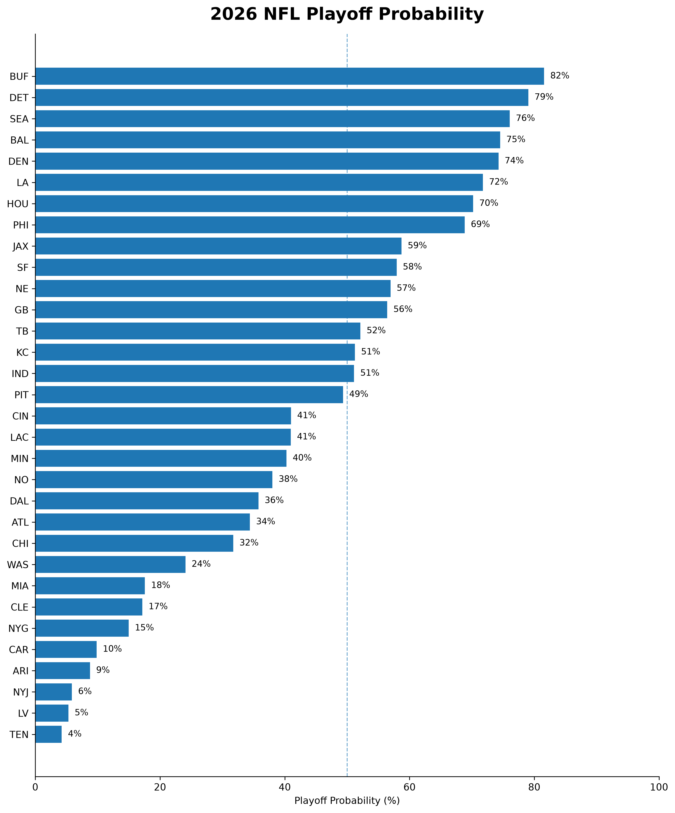
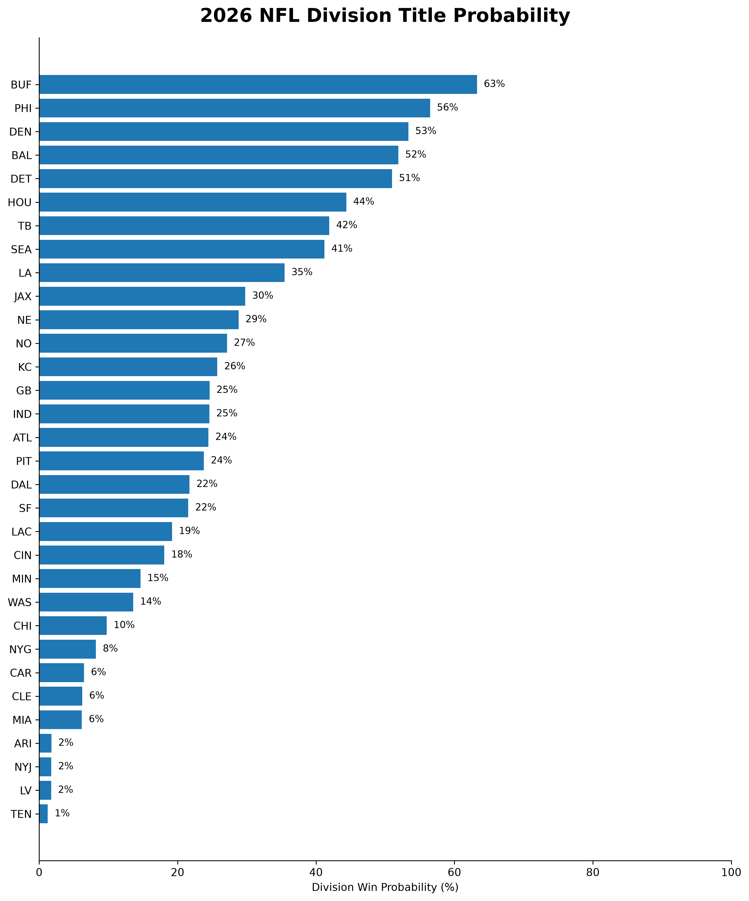

# 2026 NFL Season Projection Model

I'm building an NFL projection model to estimate team strength, predict individual games, and simulate the entire 2026 NFL season.

The main idea behind the project is that a team's record from the previous season only tells part of the story. Teams change every offseason through the draft, free agency, trades, injuries, coaching changes, player development, and roster turnover. I want the model to account for those changes while also measuring how good each team actually was before them.

The goal is to build the project from the ground up, starting with raw NFL data and ending with full 2026 season projections.

## Project Goals

The model is designed to answer a few main questions:

- How strong is each NFL team entering 2026?
- Which teams improved or declined during the offseason?
- What is each team's probability of winning an individual game?
- How many games should each team be expected to win?
- What are each team's chances of winning its division, making the playoffs, and winning the Super Bowl?

Rather than predicting one exact record for each team, the final model will simulate the season many times to show the range of possible outcomes.

## Data

The project uses historical NFL data covering several parts of team and player performance, including:

- Game results and schedules
- Player statistics
- Rosters and depth charts
- Snap counts and player participation
- Injuries
- Draft picks
- Contracts and salary cap information
- Trades

These datasets are cleaned and combined to create features that measure team performance, player value, roster strength, continuity, and other factors that could help predict future performance.

## Modeling Process

The project follows the full process from collecting raw data to producing final season projections:

```text
00_Model_Design.ipynb
        ↓
01_Data_Collection.ipynb
        ↓
02_Data_Cleaning.ipynb
        ↓
03_Feature_Engineering.ipynb
        ↓
04_Player_Projections.ipynb
        ↓
05_Team_Strength_Model.ipynb
        ↓
06_Game_Predictions.ipynb
        ↓
07_Monte_Carlo_Simulation.ipynb
        ↓
08_Model_Evaluation.ipynb
        ↓
09_Dashboard.ipynb
```

Each stage builds on the previous one. The goal is to keep the process separated enough that the data, features, projections, modeling, and evaluation can each be understood on their own.

## Final Output

The finished model will produce:

- 2026 team strength ratings
- Player and roster projections
- Game-by-game win probabilities
- Expected wins and record distributions
- Division and playoff probabilities
- Conference championship probabilities
- Super Bowl probabilities

The final dashboard will bring these results together so the projections can be explored by team and across the league.

## Why I'm Building It

I've always been interested in understanding why teams win and how much we can actually predict before a season starts.

This project is my attempt to answer that question using data while building an end-to-end NFL analytics model that covers everything from data collection and player evaluation to game predictions and full-season simulations.


### UPDATED AFTER FINISHED PRODUCT

# 2026 Final Predictions

The model's official standings prediction comes from one complete season selected from the 10,000 Monte Carlo simulations.

Expected wins are still important because they represent a team's average outcome across every simulation. But I also wanted the project to make an actual prediction instead of stopping at 8.7 wins or 9.3 wins.

Rather than manually changing records or simply rounding expected wins, I select a simulated season with a league-wide distribution of records similar to recent NFL seasons. From those realistic simulations, the model selects the season closest overall to its expected team win totals.

This gives the project one exact and internally consistent prediction for the 2026 season while leaving the underlying team ratings and game probabilities unchanged.



## Projected Division Standings

| Division | 1st | 2nd | 3rd | 4th |
|---|---|---|---|---|
| **AFC East** | BUF 15-2 | NE 7-10 | MIA 5-12 | NYJ 4-13 |
| **AFC North** | BAL 10-7 | PIT 9-8 | CIN 9-8 | CLE 5-12 |
| **AFC South** | HOU 11-6 | IND 10-7 | JAX 7-10 | TEN 5-12 |
| **AFC West** | DEN 10-7 | KC 9-8 | LAC 9-8 | LV 3-14 |
| **NFC East** | PHI 13-4 | DAL 7-10 | NYG 7-10 | WAS 6-11 |
| **NFC North** | DET 12-5 | CHI 10-7 | GB 9-8 | MIN 8-9 |
| **NFC South** | NO 9-8 | ATL 9-8 | TB 8-9 | CAR 4-13 |
| **NFC West** | LA 12-5 | SEA 11-6 | SF 11-6 | ARI 8-9 |

These records represent the model's final exact prediction, not each team's average outcome across the 10,000 simulations.

---

# Team Strength Rankings

A team's final record doesn't always tell the full story of how good that team is.

Schedule strength, close games, and normal NFL randomness can cause a team's final record to look better or worse than its underlying quality. Because of that, the model separately creates a preseason team-strength rating for all 32 teams.

The rating combines:

- Historical team performance
- Projected personnel strength
- Roster continuity

A rating above zero represents an above-average team and a rating below zero represents a below-average team.



These ratings become the foundation of the game prediction model.

---

# Expected Wins vs. Final Prediction

There are two different types of win totals used throughout the project.

**Expected wins** represent the average number of wins a team produces across all 10,000 simulated seasons. This is the model's central expectation for that team.

**Predicted wins** come from the single representative season selected as the model's official 2026 prediction.

That distinction is important because real NFL seasons don't finish with every team exactly at its average expectation.



The dashed line represents where expected wins and final predicted wins are equal. Teams above the line outperform their average simulated expectation in the final predicted season, while teams below it underperform.

---

# Playoff Outlook

The exact standings give one prediction for how the season could finish, but the Monte Carlo simulations also show the uncertainty around those predictions.

Each of the 10,000 simulated seasons is used to calculate how frequently every team reaches the playoffs and wins its division.



The model also calculates division-title probabilities for all 32 teams.



This gives more context than an exact record alone. Two teams may have similar projected records while having very different chances of reaching the postseason based on their schedule, division, and game-level probabilities.

---

# Data

The project uses historical NFL data covering several parts of team and player performance, including:

- Game results and schedules
- Player statistics
- Rosters and depth charts
- Snap counts and player participation
- Injuries
- Draft picks
- Contracts and salary cap information
- Trades

These datasets are cleaned and combined to create features measuring team performance, player value, roster strength, continuity, and other factors that could help predict future performance.

One thing I wanted to avoid was starting with an existing set of power rankings or team ratings. The goal was to build those ratings through the pipeline itself.

---

# Modeling Process

The project follows the full process from collecting raw data to producing final season projections:

```text
00_Model_Design.ipynb
        ↓
01_Data_Collection.ipynb
        ↓
02_Data_Cleaning.ipynb
        ↓
03_Feature_Engineering.ipynb
        ↓
04_Player_Projections.ipynb
        ↓
05_Team_Strength_Model.ipynb
        ↓
06_Game_Predictions.ipynb
        ↓
07_Monte_Carlo_Simulation.ipynb
        ↓
08_Model_Evaluation.ipynb
        ↓
09_Dashboard.ipynb